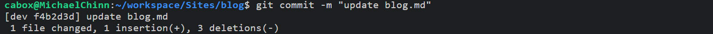
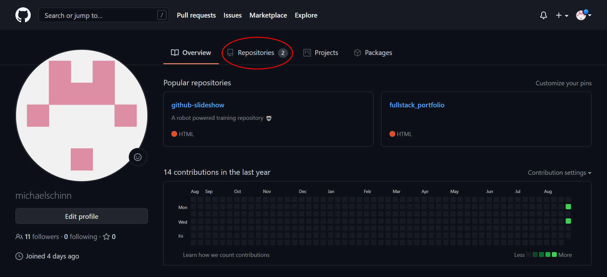
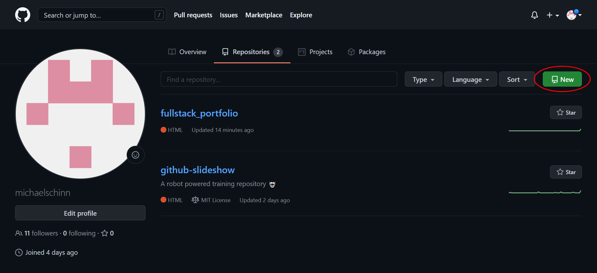
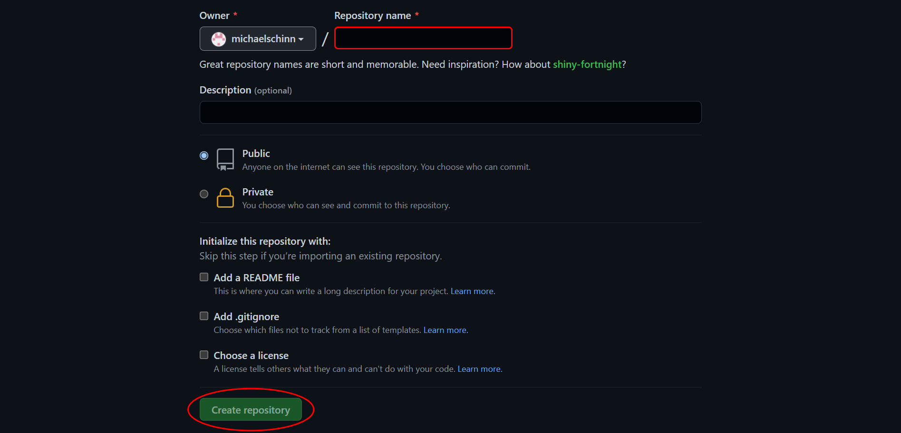
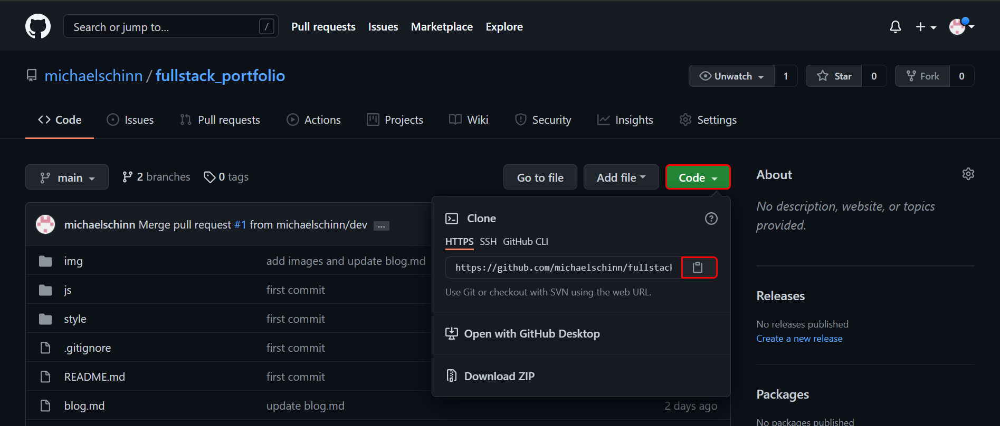

### Mike's Technical Blog
By: Michael Chinn

---
## This is where I will be posting all of my daily / weekly progress and developments while I am attending the **Awesome Inc. Coding Bootcamp**.

# *8/26/2021* | **Git Over Here!** | *My First Week at Awesome Inc.*

---
This week I began the [**Awesome Inc Coding Bootcamp**](https://www.awesomeinc.org/bootcamp) and so far I'm very impressed! I learned about an online IDE called [CodeAnywhere](https://codeanywhere.com/), which is very akin to VS Code, save that it is written entirely in javascript (very cool), as well as receiving an extensive refresher on using [GitHub](https://github.com/)!

I've used GitHub in the past when I was a front-end web developer, but never as in-depth as they are teaching me it can be utilized. As well as, I'm learning that the amount of the things you can forget in 6 years is shocking.

*6 years is a long time!*

The following are some examples of all that we have gone over in regards to GitHub.

## The Process of Utilizing GitHub

- Initialize your local repository.
- Check the status of your local repo.
- Add files to be commited.
- Commit your changes.
- Create an Empty Repository on the GitHub Server
- Push your new content up to the GitHub Server.
- Execute a pull request on your changes.
- Create a "Dev" branch
- Merge your changes into the main branch.
  
## Initialize Your Local Repository

It's the simplest of things that make all the difference. This eight character command...

`git init`

...is where it all begins. With it you can "Create an empty Git repository or reinitialize an existing one."[*¹*](https://git-scm.com/docs/git-init) In short, it makes it possible to create branches, commit changes, push said changes up to the server, and so much more! None of this would be able to be done without first initializing a local repository. 

*¹ From: [https://git-scm.com/docs/git-init](https://git-scm.com/docs/git-init)*

 
## Checking the status of your local repo.
It is important to be able to see the difference between what you have on your local repo and your repo on Github. To do this you will use...

`git status`

This is a very useful command. What it does is "Show the working tree status."[²](https://git-scm.com/docs/git-status) It allows you to see what is committed, what is yet to be committed and what needs to be added to be included in your next commit.

*Git status output.*

*² From: [https://git-scm.com/docs/git-status](https://git-scm.com/docs/git-status)*

 
## Add files to be committed.
Now, we will look into how to update the index with the changes we've made to the working tree. This is done with the command...

`git add -A`

This command allows us to "Add file contents to the index"[*³*](https://git-scm.com/docs/git-add). Without it Git would not know that we wanted to include the changes we've made into the next commit. The option `-A` lets Git know that we want it to look at all of the files that are indexed and add the ones that differ from the working tree *(eg. The files we've changed)*.

*³ From: [https://git-scm.com/docs/git-add](https://git-scm.com/docs/git-add)*

 

## Commit your changes.
Okay, now that we have added our changes to the index it is time to record/commit them to the repository. This is done using the command...

`git commit -m "message"`

It's used to "Record changes to the repository"[⁴](https://git-scm.com/docs/git-commit). You can see that the `git commit` command is followed by the option `-m "message"`, this is used to enter a description of the changes that are being recorded to the repository.

*Git commit output.*

*⁴ From: [https://git-scm.com/docs/git-commit](https://git-scm.com/docs/git-commit)*

 

## Create an Empty Repository on the GitHub Server
When you first login to GitHub you will be on the "Overview" tab. From here you will want to navigate to the "Repository" tab.

*Overview tab.*

 
From the Repository page, click on the "New" button.

*Repository tab.*

 
Here you will give your new repository a name and select any additional options for it.

*(Note: Name is the only required field for creating a new repository.)*

With the name field filled out, you can now click the "Create repository" button.

*New repository page.*

And thats it! GitHub will automatically redirect you into your new repo. You can start pushing and pulling content from your development environment to your new repository!

Now we will go back to your CLI so that we can start wrapping up the setup for your new repository.

 

## Setup your target branch
Next we need to move Git's attention to the name of the default branch we will be pushing our inital content up to. This is where we use the command...

`git branch -M main`

What the `git branch` command does is "List, create, or delete branches" [*⁵a*](https://git-scm.com/docs/git-branch). the option `-M` [*⁵b*](https://git-scm.com/docs/git-branch/#Documentation/git-branch.txt--M) is a combination of two options:
- `--move` : "Move/rename a branch and the corresponding reflog." [*⁵c*](https://git-scm.com/docs/git-branch/#Documentation/git-branch.txt--move)
- `--force` : "Reset 'branchname' to 'startpoint', even if 'branchname' exists already." [*⁵d*](https://git-scm.com/docs/git-branch/#Documentation/git-branch.txt--force)

So in essence, this will create a new branch in our development environment and sets it's name to be `main`. 

*⁵ From: [https://git-scm.com/docs/git-branch](https://git-scm.com/docs/git-branch)*

 

## Assign your origin URL
Next we need to setup which repository to track at a remote location. Specifically we want to track our new repository on GitHub. To do this we will use the command...

`git remote add origin URL`

With this command we can "Manage set of tracked repositories" [*⁶*](https://git-scm.com/docs/git-remote). The `add` command will "Add a remote named 'name' for the repository at 'url'." In this case our 'name' will be `origin`, and our remote repository will be the URL to our repo on GitHub!.

We can easily obtain the URL by going to the "Code" tab for our repo on GitHub. Then we simple click on the green "Code" button and when the context menu drops down, we click the copy to clipboard button located next to the input field with the URL in it.

*Copy repository URL*

*⁶ From: [https://git-scm.com/docs/git-remote](https://git-scm.com/docs/git-remote)*

## Push your new content up to the GitHub Server.
`git push -u origin main`
## Execute a pull request on your content.
## Create a Dev branch
## Merge your changes into the main branch.

What's really **Awesome** is that in the past, I never learned to use the GitHub website beyond cloning repos and viewing files. The majority of my experience with it was through a CLI, so it was a real treat to learn the ins and outs of it.

I thank God that I have access to all of the knowledge and experience of the instructors. I can tell that the Bootcamp is going to be a real game changer for me. :)

---